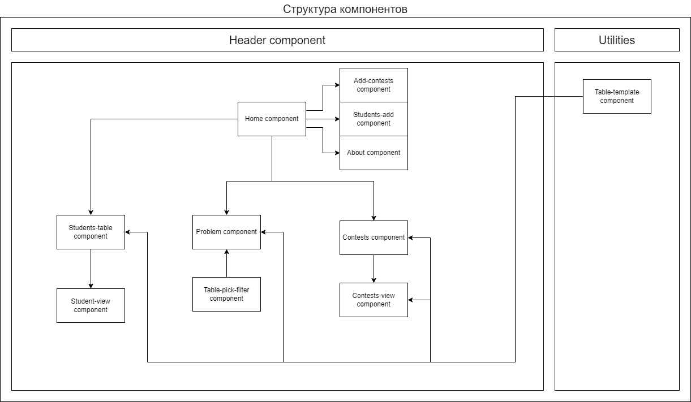

## Docker

`docker build -t etrx_image . --no-cache` - Для создания образа в docker.

`--no-cache` для создания образа с нуля, для того, чтобы закешированные данные не помешали работе приложения.

`docker run -d -p 4000:80 -it --name etrx_container etrx_image` - Для запуска образа в контейнере на порте 4000.

После этого приложение доступно по адресу:  `http://localhost:4000/etrx/`

## Тестовый сервер

`ng serve` Для запуска dev сервера. Приложение запускается на `http://localhost:4200/`.

## Build

`ng build` — для компиляции в html,css,js. Скомпилированные файлы располагаются в `dist/browser`.

## Документация (Swagger)

Etr API — `https://dl.gsu.by/etr/docs`

## Структура компонентов

Header Component — компонент, со ссылками на другие страницы.

Компоненты, зависящие от адреса:
- Home Component — компонент главной страницы;
- About Component — компонент, в котором отображаются все обновления;
- Contests Component — таблица контестов и тренировок;
- Contest-view Component — подробная информация о каждом контесте;
- Add-contests Component — компонент добавления контестов;
- Students-table Component — таблица учеников;
- Student-view Component — подробная информация об ученике;
- Students-add Component — компонент добавления учеников.
- Problem Component - компонент задач

Table-template Component — компонент, отвечающий за таблицы.
Table-pick-filter Component - компонент, отвечающий за фильтрацию тегов в компоненте задач